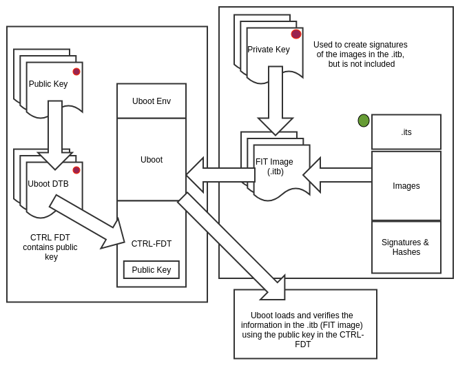
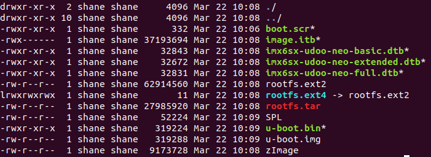

# Udoo Neo Buildroot Secure
> A project to create a secure FIT image for the Udoo Neo using Buildroot

## Table of contents
* [General info](#general-info)
* [Screenshots](#screenshots)
* [Technologies](#technologies)
* [Project Setup](#Project-Setup)
* [Buildroot Configuration](#Buildroot-Configuration)
* [Features](#features)
* [Status](#status)
* [Inspiration](#inspiration)
* [Contact](#contact)
* [Links](#links)

## General info
Buildroot set-up to generate a secure FIT image for the Udoo Neo. The project uses Buildroot's external tree mechanism to allow for easy version control.

## Screenshots


## Technologies
* Buildroot - version 2021.02
* RSA Encryption
* OP-TEE
* Udoo Neo

## Project Setup
To run this project clone the repo, update the Buildroot submodule, generate the RSA key, then build the project.
```
$ git clone https://github.com/shanemmattner/udoo_neo_buildroot_secure.git
$ cd udoo_neo_buildroot_secure
$ git submodule update --init --recursive
$ openssl genrsa -out br-external/keys/dev.key 2048
$ openssl req -new -key br-external/keys/dev.key -out br-external/keys/dev.csr
$ make -C buildroot BR2_EXTERNAL=../br-external O=../br-external/
```
The output 'image.itb' will be in <ins>**br-external/images**</ins>:


## Buildroot Configuration
Here are the steps I did to set-up this project.

First, we add buildroot as a submodule.
```
$ git submodule add git://git.buildroot.net/buildroot
```
Now we must make the recommended directory structure for the br2-external tree.  This will allow us to version control our Buildroot configuration.  In order for Git to register the folders we must create a file within them, this is the reason for 'touch ".../file"'.
```
$ mkdir br-external
$ mkdir -p "br-external/target_overlay" && touch "br-external/target_overlay/file"
$ mkdir -p "br-external/board/company/boardname/rootfs_overlay/etc" && touch "br-external/board/company/boardname/rootfs_overlay/etc/file"
$ mkdir -p "br-external/board/company/boardname/rootfs_overlay/etc" && touch "br-external/board/company/boardname/rootfs_overlay/etc/file"
$ mkdir -p "br-external/board/company/boardname/patches" && touch "br-external/board/company/boardname/patches/file"
$ mkdir -p "br-external/configs" && touch "br-external/configs/file"
$ mkdir -p "br-external/package/company" && touch "br-external/package/company/file"
$ mkdir -p "br-external/keys" && touch "br-external/keys/file"

```
Next we creat the external.desc file in /br-external/
```
$ vim br-external/external.desc
```
Enter the following and exit:
`name: Udoo_Neo`

Make a copy of the Udoo Neo defconfig in the external tree
```
$ cp buildroot/configs/mx6sx_udoo_neo_defconfig br-external/configs/

```
Make the defconfig and point the output toward the external tree.   Then save that defconfig
```
$ make -C buildroot defconfig BR2_EXTERNAL=../br-external BR2_DEFCONFIG=../br-external/configs/mx6sx_udoo_neo_defconfig O=../br-external/
```
Make menuconfig and select the options below:

Select these options in the menuconfig
* Build options >> Enable compiler cache >> 'y'
* System configuration >> Root filesystem overlay directories >> 'target_overlay'
* System configuration >> Custom scripts to run after creating filesystem images >> '../post-image-signatures.sh'
* Toolchain >> Toolchain Type >> External toolchain
* Toolchain >> Toolchain Type >> Copy gdb server to the Target >> 'y'
* Target packages >> Security >> optee-client >> 'y'
* Target packages >> Networking applications >> dropbear >> 'y'
* Bootloaders >> U-Boot needs OpenSSL >> 'y'
* Host utilities >> Flattened Image Tree (FIT) support >> 'y'
* Host utilities >> FIT signature verification support >> 'y'
```
$ cd br-external
$ make menuconfig
```

Save the defconfig
```
$ make savedefconfig
```

Make the image
```
$cd .. # Move to git root dir
$ make -C buildroot BR2_EXTERNAL=../br-external O=../br-external/

```
#TODO: Change this to make a FIT format SD card
Move files to SD card

```
$ sudo dd if=output/images/sdcard.img of=/dev/mmcblk0 bs=1M conv=fdatasync status=progress
```

## Features
List of features ready and TODOs for future development
* Verified boot
* OP-TEE Secure
* Awesome feature 3

To-do list:
* Build image using defconfig instead of .config
* Use OP-TEE

## Status
_in progress_

## Inspiration
Motivated by an employment screening question.

## Contact
Project created by Shane Mattner  
Readme template created by [@flynerdpl](https://www.flynerd.pl/)

## Links
##### Source Control
* [Buildroot source control](https://stackoverflow.com/questions/21006549/how-to-get-a-buildroot-project-under-source-control)
* [Buildroot manual - Keep customizations outside of Buildroot](https://buildroot.org/downloads/manual/manual.html#outside-br-custom)
* [Buildroot manual - Recommended directory structure](https://buildroot.org/downloads/manual/manual.html#customize-dir-structure)
##### Verified Boot
* [VerifiedBoot using Buildroot for nitrogen6sx](https://github.com/pratapms/VerifiedBoot)
* [Verified Boot – Introduction to U-Boot’s Secure Boot](https://web.archive.org/web/20190104025413/https://www.pacificsimplicity.ca/blog/verified-boot-%E2%80%93-introduction-u-boot%E2%80%99s-secure-boot)
* [U-Boot_verified_RSA_boot_flow_on_arm_target](https://www.denx.de/wiki/pub/U-Boot/MiniSummitELCE2013/U-Boot_verified_RSA_boot_flow_on_arm_target.pdf)
* [Verified U-Boot](https://lwn.net/Articles/571031/)
##### OP-TEE Trusted Execution Environment
* [Op-tee on RPi using Buildroot](https://blog.crysys.hu/2018/06/op-tee-default-build-and-installation-on-the-raspberry-pi/)
* [About OP-TEE](https://optee.readthedocs.io/en/latest/general/about.html)
##### Buildroot
* [Buildroot on i.MX6 UDOO NEO Hardware](https://www.youtube.com/watch?v=wGXgeQ5KK7A&t=761s)
* [RPi on Buildroot](https://blog.crysys.hu/2018/06/using-buildroot-to-create-custom-linux-system-images/)
* [Bootlin Buildroot Training slides](https://bootlin.com/doc/training/buildroot/buildroot-slides.pdf)
* [Bootling Buildroot Training labs](https://bootlin.com/doc/training/buildroot/buildroot-labs.pdf)
* [Bootling Buildroot STM32MP1](https://bootlin.com/blog/building-a-linux-system-for-the-stm32mp1-basic-system/)
* [My 6 tips for working with Buildroot](https://www.viatech.com/en/2015/06/buildroot/)
* [Buildroot cheat sheet](https://blog.inf.re/buildroot-cheatsheet.html)
* [Buildroot-part 1](https://boozlachu.medium.com/buildroot-part-1-general-information-minimum-system-build-setup-via-menu-32fdb389eebc)
##### FIT format
* [Example FIT image](https://gist.github.com/Informatic/10f0832d8971c4d874210dc984462e5b)
* [U-BOOT Images](https://xilinx-wiki.atlassian.net/wiki/spaces/A/pages/18842374/U-Boot+Images)
* [Image format info](https://www.marcusfolkesson.se/blog/fit-vs-legacy-image-format/)
